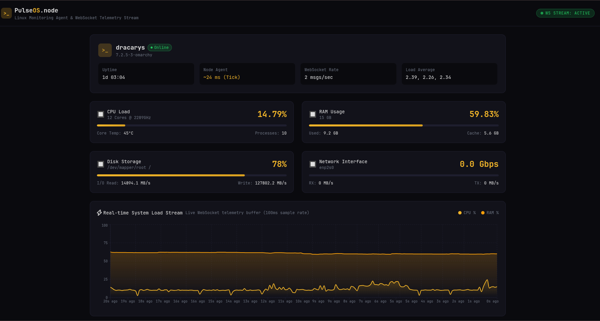

# PulseOS.node

> Real-time Linux server monitoring dashboard with cyberpunk aesthetics.



## Overview

PulseOS.node is a full-stack monitoring solution that collects system metrics (CPU, RAM, disk, network, processes) via a Fastify agent, streams them over WebSocket, and displays everything in a real-time Next.js dashboard with a cyberpunk theme.

## Tech Stack

| Layer | Technology |
|-------|------------|
| Agent | Fastify 5, WebSocket, Zod 4, Node.js `child_process` |
| Dashboard | Next.js 14, React, shadcn/ui, Recharts, Tailwind CSS |
| Shared | TypeScript types + Zod schemas |
| Tooling | BiomeJS, Vitest, Playwright, Lefthook, GitHub Actions |
| Package manager | pnpm 10 (workspaces) |

## Architecture

Monorepo with hexagonal architecture (ports & adapters) in the agent.

```
monitor/
├── apps/
│   ├── agent/          # Fastify 5 API + WebSocket + metric collectors
│   └── dashboard/      # Next.js 14 + shadcn/ui + Recharts
├── packages/
│   └── shared/         # TypeScript types + Zod schemas
├── .github/workflows/  # CI (lint, test, E2E)
└── pnpm-workspace.yaml
```

## Getting Started

### Prerequisites

- Node.js >= 20
- pnpm >= 10
- Linux (agents read `/proc/` and run `ps`/`df`)

### Install

```bash
pnpm install
```

### Run (development)

```bash
# Start both agent (:3001) and dashboard (:3000)
pnpm dev

# Or individually
pnpm dev:agent
pnpm dev:dashboard
```

The dashboard opens at [http://localhost:3000](http://localhost:3000). The API docs (Scalar) are available at [http://localhost:3001/docs](http://localhost:3001/docs).

## Commands

| Command | Description |
|---------|-------------|
| `pnpm dev` | Start agent + dashboard in parallel |
| `pnpm build` | Build all packages |
| `pnpm test` | Run unit tests (Vitest) |
| `pnpm test:watch` | Run tests in watch mode |
| `pnpm test:e2e:agent` | Run agent E2E tests (Playwright) |
| `pnpm test:e2e:dashboard` | Run dashboard E2E tests (Playwright) |
| `pnpm lint` | Lint with BiomeJS |
| `pnpm lint:fix` | Auto-fix lint issues |
| `pnpm typecheck` | Type-check all packages |

## Features

- **Real-time metrics** — CPU, RAM, disk, network, processes via WebSocket
- **Auto-broadcast** — Agent pushes metrics every 2 seconds
- **Process management** — Kill processes directly from the dashboard
- **Real-time chart** — Live CPU/RAM history with Recharts
- **Core visualization** — Individual core temperature and usage
- **WebSocket event stream** — Live event log with send/receive counters
- **API documentation** — Scalar interactive docs at `/docs`
- **Cyberpunk theme** — Dark UI with gold accents and JetBrains Mono

## Testing

```bash
# Unit tests (111 tests)
pnpm test

# E2E tests (Playwright)
pnpm test:e2e:agent
pnpm test:e2e:dashboard
```

## CI

GitHub Actions runs 3 parallel jobs on every push:

- **Lint & Typecheck** — BiomeJS + TypeScript
- **Unit Tests** — Vitest across all workspaces
- **E2E Tests** — Playwright (agent + dashboard)

## Project Structure

### Agent (`apps/agent/`)

```
src/
├── modules/metrics/
│   ├── domain/          # Entities, repository contract, errors
│   ├── use-cases/       # CollectMetrics, GetMetrics, KillProcess
│   └── infra/           # Collectors (CPU, RAM, Disk, Network, Processes)
├── routes/              # REST + WebSocket routes
└── server.ts            # Fastify server setup
```

### Dashboard (`apps/dashboard/`)

```
app/
├── page.tsx             # Main dashboard page
└── layout.tsx           # Root layout
components/
├── header.tsx           # Top bar with WS status
├── server-info-card.tsx # Hostname, uptime, load average
├── metric-card.tsx      # CPU, RAM, disk, network cards
├── gradient-gauge.tsx   # Progress bar component
├── real-time-chart.tsx  # Live CPU/RAM chart (Recharts)
├── core-cluster.tsx     # Core temperature grid
├── process-table.tsx    # Process list with kill action
└── ws-event-stream.tsx  # WebSocket event log
hooks/
└── use-websocket.ts     # Auto-reconnect WebSocket hook
```

## License

Private — not for distribution.
